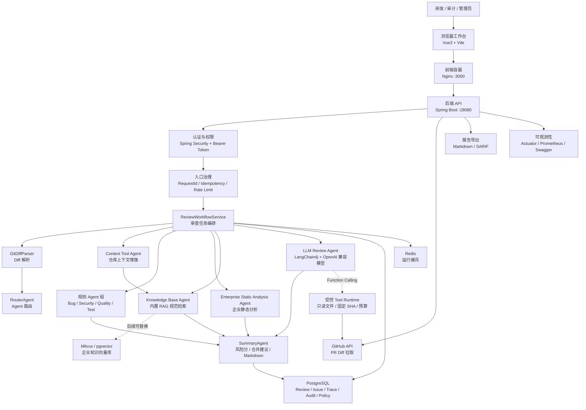
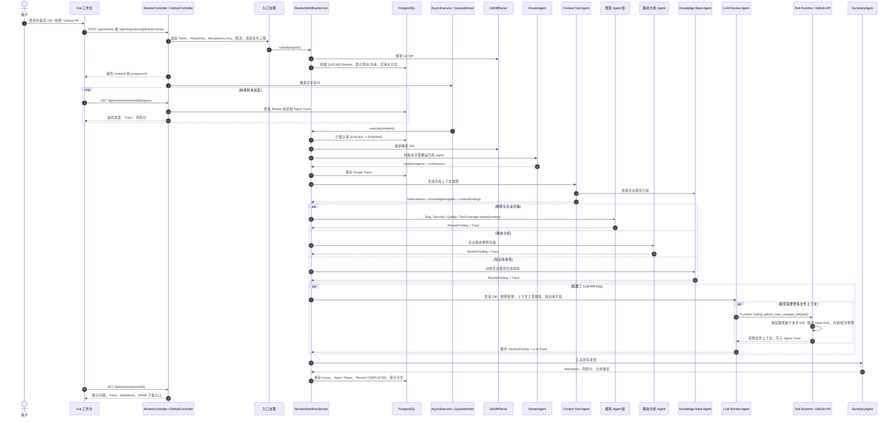

# CodeGuard Agent

CodeGuard Agent 是一个基于 Spring Boot、LangChain4j 和 Vue3 的企业级多 Agent 代码审查平台。系统支持提交 Git Diff 或 GitHub Pull Request，由 Router、上下文工具、Bug、安全、质量、测试覆盖、企业静态分析、知识库和 LLM 审查 Agent 协同分析，输出风险评分、合并建议、Agent Trace、Markdown 报告和 SARIF 报告。

## 技术栈

Spring Boot、LangChain4j、Vue3、PostgreSQL、Redis、Flyway、Spring Security、Springdoc OpenAPI、Docker、SARIF

## 系统架构



## 多 Agent 协作时序



## 核心功能

- 多 Agent 审查链路：按职责拆分路由、Bug、安全、代码质量、测试覆盖和 LLM 综合审查。
- 仓库上下文工具：对变更文件、风险路径、测试配套和关键边界做上下文增强；对于 GitHub PR，LLM 可通过 LangChain4j Function Calling 按需请求 `github_read_changed_file`。服务端只允许读取本次 Diff 中的 Java 文件，并固定到本次 PR 的 `head SHA`，每份内容截断为 3,000 字符、最多两轮调用，工具调用过程进入 Agent Trace 审计。
- 企业知识库检索：内置安全、SQL、文件上传、依赖治理、审计和异步任务可靠性规范，后续可替换为 Milvus 或 pgvector。
- 企业静态分析：内置供应链、线程池治理、危险 JVM 退出和安全 TODO 规则，并预留 Semgrep、SpotBugs、依赖扫描器接入边界。
- 企业工作台：支持概览看板、审查任务、项目资产、策略中心、Agent 目录和审计日志。
- 异步任务执行：提交任务后后台执行，前端轮询展示进度和每个 Agent 的运行状态。
- 入口和任务治理：支持请求追踪 ID、提交幂等、提交频率限制、组织级活跃任务上限、队列兜底派发和运行超时恢复。
- 数据持久化：项目、仓库、审查任务、问题明细、Agent Trace、策略和审计日志写入数据库。
- 报告导出：支持 Markdown 审查报告和 SARIF 标准格式，便于对接代码扫描平台。
- 工程化部署：提供 Docker Compose、一键启动脚本、Swagger UI、健康检查、Prometheus 指标和 CI 构建。

## 快速启动

先启动 Docker Desktop，然后在项目根目录执行：

```powershell
.\codeguard.bat start
```

访问地址：

- 前端工作台：http://localhost:3000
- 后端健康检查：http://localhost:18080/api/health
- Swagger UI：http://localhost:18080/swagger-ui/index.html
- Actuator：http://localhost:18080/actuator/health

演示账号：

```text
admin / codeguard123
developer / developer123
auditor / auditor123
```

常用命令：

```powershell
.\codeguard.bat start          # 打包并启动服务
.\codeguard.bat start -Open    # 启动后打开前端页面
.\codeguard.bat restart        # 重启服务
.\codeguard.bat status         # 查看容器状态
.\codeguard.bat logs           # 查看实时日志
.\codeguard.bat test           # 后端测试 + 前端构建
.\codeguard.bat stop           # 停止服务
```

## 项目结构

```text
multi_agent_java/
  backend/        Spring Boot 后端服务
  frontend/       Vue3 前端工作台
  scripts/        启动、停止、测试脚本
  docker-compose.yml
  codeguard.bat
  run.bat
```

## LLM 配置

公开仓库不包含任何真实 API Key。未配置 Key 时，LLM Agent 会自动跳过，规则 Agent 仍可正常运行。

当前知识库默认使用内置策略文档，保证 Docker 演示环境无需额外部署向量数据库。生产环境如果需要接入 RAG，可以把 `EnterpriseKnowledgeBaseService` 的检索实现替换为 Milvus、pgvector 或企业知识库服务，接口返回仍保持 `ReviewKnowledgeSnippet`。

GitHub PR 可手动提交，也支持 GitHub Webhook 自动触发。自动触发时需要配置只读仓库访问 Token 和 Webhook Secret：

```powershell
$env:GITHUB_TOKEN="github-token"
$env:GITHUB_WEBHOOK_SECRET="random-webhook-secret"
```

在 GitHub App 或仓库 Webhook 中把 `pull_request` 的 `opened`、`reopened`、`synchronize` 事件发送到：

```text
POST /api/integrations/github/webhook
```

服务会校验 `X-Hub-Signature-256`，用 `X-GitHub-Delivery` 去重，并异步创建审查任务。当前集成只读取 PR 和受控仓库上下文，不会自动写入 GitHub 评论或修改代码；正式多租户接入应使用 GitHub App Installation Token 和仓库到组织的授权映射，不能把 PAT 当作最终方案。

本地使用真实模型时，可以通过环境变量配置：

```powershell
$env:CODEGUARD_LLM_PROVIDER="deepseek"
$env:CODEGUARD_LLM_API_KEY="your-api-key"
$env:CODEGUARD_LLM_BASE_URL="https://api.deepseek.com"
$env:CODEGUARD_LLM_MODEL="deepseek-v4-flash"
```

也可以参考 `backend/src/main/java/com/codeguard/agent/config/CodeGuardLocalLlmConfig.java.example` 创建本地私有配置文件。该私有配置文件已加入 `.gitignore`，不会被提交到仓库。

## 本地开发

后端：

```powershell
cd backend
mvn spring-boot:run
```

本地后端接口文档：http://localhost:8080/swagger-ui/index.html

前端：

```powershell
cd frontend
npm install
npm run dev
```

## 测试

```powershell
.\codeguard.bat test
```
